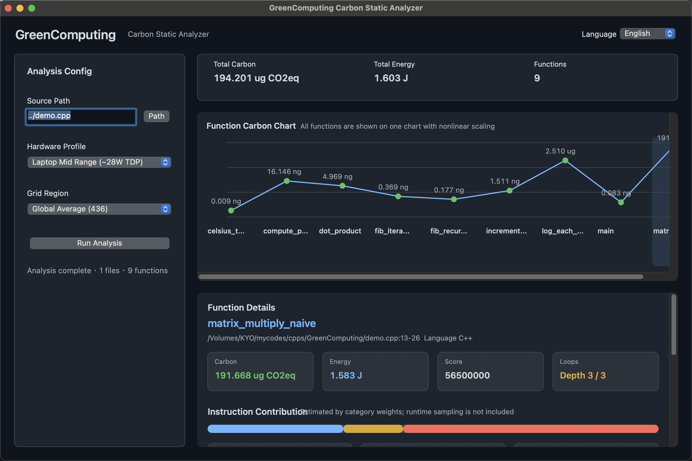

# GreenComputing

**English** · [中文](README.zh-CN.md)

> Estimate per-function energy use and carbon hotspots from a source file or an
> entire project folder, without leaving a desktop GUI or terminal workflow.

GreenComputing is a C++ static analysis tool with a native macOS app, a Qt GUI
for Windows / Linux, and a command-line interface. It scans source code,
detects functions across multiple languages, estimates instruction-category
activity, applies a hardware power model, and reports relative carbon hotspots
for optimization work.

Please always use the latest version. More features will be added.

The `GreenComputingCLI` binary is also a regular standalone entry point, so you
can run the same analysis in scripts, CI, or directly against project folders.

[](https://github.com/Azukibits/GreenComputing/actions/workflows/release.yml)



Analyze one file or a whole mixed-language project, then inspect hotspots in
the same window with hardware and grid-region presets:

## Features

- Function-level energy and carbon estimation
- Analyze a single source file or a whole project folder
- Native macOS GUI plus Qt GUI on Windows / Linux
- Command-line interface for local scripts and CI
- Source detection for C, C++, Java, JavaScript, TypeScript, Go, C#, Rust,
  Python, PHP, Kotlin, and Swift
- Per-function hotspot ranking, carbon chart, and instruction breakdowns
- Hardware profile presets from edge devices to workstations and servers
- Grid-region presets for carbon-intensity comparison
- Bilingual desktop interface: English and Chinese

## Requirements

- One of:
  - **macOS** with Apple Command Line Tools or Xcode
  - **Windows** with a C++20 compiler and **Qt 6** for GUI builds
  - **Linux** with a C++20 compiler and **Qt 6** for GUI builds
- **CMake 3.20+**

## Quick install (recommended)

1. From the [Releases page](https://github.com/Azukibits/GreenComputing/releases),
   download the package for your platform:
   - macOS: `GreenComputing-macos.dmg`
   - Linux: `GreenComputing-linux.tar.gz`
   - Windows: `GreenComputing-windows.zip`
2. Extract or open the package.
3. Launch the GUI for your platform:
   - macOS: open `GreenComputing.app`
   - Linux: run `run-greencomputing.sh`
   - Windows: run `GreenComputing.exe`
4. Select either a source file or a project folder, choose a hardware profile
   and grid region, then run analysis.

## Troubleshooting

### macOS blocks the app or CLI after downloading

If you installed GreenComputing from a downloaded package, macOS Gatekeeper may
mark the app bundle or CLI binary as quarantined.

The extracted package should look like this:

```text
GreenComputing-macos/
├── GreenComputing.app
├── GreenComputingCLI
├── README.md
├── README.zh-CN.md
├── demo.cpp
└── demos/
```

To remove the quarantine attribute from the extracted folder, run:

```sh
xattr -dr com.apple.quarantine /path/to/GreenComputing-macos
```

If you still have the original `.dmg`, you can also remove the quarantine
attribute before opening it:

```sh
xattr -d com.apple.quarantine ~/Downloads/GreenComputing-macos.dmg
```

> Only remove the quarantine attribute from files downloaded from a trusted
> source, such as this repository's official Releases page, or files you built
> yourself from source.

### Windows blocks the downloaded executables

If you installed GreenComputing from a downloaded `.zip`, Windows may mark the
included `.exe` files as downloaded from the Internet.

The extracted package should look like this:

```text
GreenComputing-windows/
├── GreenComputing.exe
├── GreenComputingCLI.exe
├── README.md
├── README.zh-CN.md
├── demo.cpp
└── demos/
```

To unblock the executables, run:

```powershell
Unblock-File -Path "C:\path\to\GreenComputing-windows\*.exe"
```

Or unblock the whole extracted folder:

```powershell
Get-ChildItem "C:\path\to\GreenComputing-windows" -Recurse | Unblock-File
```

> Only unblock files downloaded from a trusted source, such as this
> repository's official Releases page, or files you built yourself from source.

## Build from source

For developers who want to hack on the analyzer, extend the language support,
or build unreleased changes.

Prerequisites:

- A **C++20** compiler
- **CMake 3.20+**
- **macOS**: Apple Command Line Tools or Xcode
- **Windows / Linux GUI builds**: **Qt 6 Widgets**

```sh
git clone https://github.com/Azukibits/GreenComputing.git
cd GreenComputing

cmake -S . -B build -DCMAKE_BUILD_TYPE=Release
cmake --build build --config Release --target GreenComputing GreenComputingCLI
```

Generated outputs:

- macOS GUI app: `build/GreenComputing.app`
- Windows / Linux GUI app: `build/GreenComputing` or `build/Release/GreenComputing.exe`
- CLI: `build/GreenComputingCLI` or `build/Release/GreenComputingCLI.exe`

## Use from CLI

You can analyze a single file:

```sh
./build/GreenComputingCLI demo.cpp --no-color
```

You can also analyze a whole project folder:

```sh
./build/GreenComputingCLI /path/to/project --hw laptop_mid --grid global
```

The repository also includes a mixed-language test folder:

```sh
./build/GreenComputingCLI demos --no-color
```

`demos/` currently includes sample files for C++, Python, PHP, Kotlin, Swift,
Java, JavaScript, TypeScript, Go, C#, and Rust so you can quickly regression
test project-folder analysis.

Selected CLI behavior:

| Item | Purpose |
|------|---------|
| `<source-file-or-dir>` | Analyze one source file or recurse through a project folder |
| `--hw <key>` | Select a hardware profile preset |
| `--grid <key>` | Select a grid-region carbon-intensity preset |
| `--list-hw` | Print all hardware profile keys |
| `--list-grids` | Print all grid-region keys |
| `--no-color` | Disable ANSI colors in the terminal report |

## Status / roadmap

What works today (`v0.3.0`):

- [x] macOS native GUI and Windows / Linux Qt GUI
- [x] Command-line interface
- [x] Source file and project-folder analysis
- [x] Multi-language function extraction: C, C++, Java, JavaScript, TypeScript,
      Go, C#, Rust, Python, PHP, Kotlin, Swift
- [x] Function hotspot ranking, chart selection, and detailed instruction
      breakdowns
- [x] Mixed-language project summaries
- [x] Hardware profiles from Raspberry Pi to workstation and server classes
- [x] Grid-region presets for carbon comparison
- [x] GitHub Actions packaging for macOS, Linux, and Windows

Planned next:

- [ ] Improve parser accuracy for more real-world syntax patterns
- [ ] Add richer function and file-level summaries
- [ ] Add exportable machine-readable reports
- [ ] Add more hardware and regional carbon datasets

## License

MIT — see [LICENSE](LICENSE).
