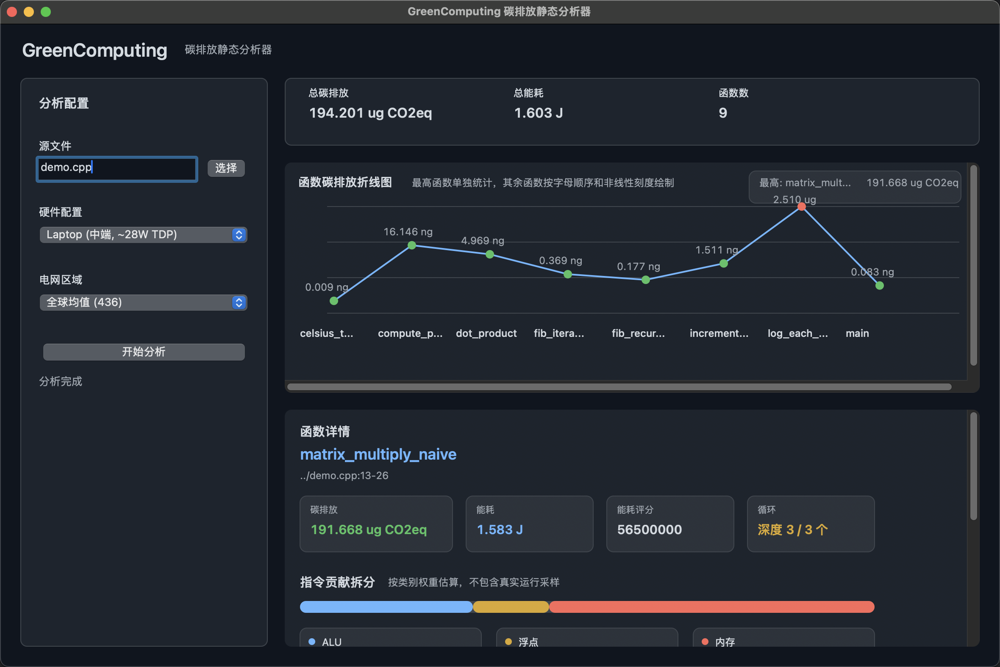

# GreenComputing

[English](README.md) · **中文**

> 无需离开图形界面或终端工作流，就可以从单个源文件或整个项目目录中估算
> 函数级能耗和碳排放热点。

GreenComputing 是一个用 C++ 编写的静态分析工具，提供原生 macOS 图形界面、
Windows / Linux Qt 图形界面，以及命令行接口。它会扫描源码、识别多语言函数、
估算指令类别活动量、套用硬件功耗模型，并给出相对碳排放热点，帮助你判断优化优先级。

请始终使用最新版本。后续会继续加入更多功能。

`GreenComputingCLI` 本身也是一个独立入口，因此你也可以在脚本、CI，或者直接对项目目录执行同样的分析。

[](https://github.com/Azukibits/GreenComputing/actions/workflows/release.yml)



你可以分析单个文件，也可以分析整个混合语言项目；结果会在同一个窗口中展示热点函数、硬件配置和电网区域对比：

## 功能特性

- 函数级能耗和碳排放估算
- 支持分析单个源文件或整个项目目录
- 原生 macOS 图形界面，以及 Windows / Linux Qt 图形界面
- 适合本地脚本和 CI 的命令行接口
- 支持 C、C++、Java、JavaScript、TypeScript、Go、C#、Rust 源码检测
- 提供函数热点排名、碳排放折线图和指令贡献拆分
- 提供从边缘设备到工作站、服务器的硬件配置预设
- 提供多电网区域碳强度预设
- 桌面界面支持中英文切换

## 系统要求

- 以下任一环境：
  - **macOS**，安装 Apple Command Line Tools 或 Xcode
  - **Windows**，带 C++20 编译器，并在 GUI 构建时安装 **Qt 6**
  - **Linux**，带 C++20 编译器，并在 GUI 构建时安装 **Qt 6**
- **CMake 3.20+**

## 快速安装，推荐方式

1. 从 [Releases 页面](https://github.com/Azukibits/GreenComputing/releases)
   下载对应平台的发布包：
   - macOS：`GreenComputing-macos.dmg`
   - Linux：`GreenComputing-linux.tar.gz`
   - Windows：`GreenComputing-windows.zip`
2. 解压或打开发布包。
3. 启动对应平台的图形界面：
   - macOS：打开 `GreenComputing.app`
   - Linux：运行 `run-greencomputing.sh`
   - Windows：运行 `GreenComputing.exe`
4. 选择源文件或项目目录，再选择硬件配置和电网区域，最后执行分析。

## 故障排查

### macOS 下载后阻止应用或 CLI

如果你是从下载的安装包中获取 GreenComputing，macOS Gatekeeper 可能会把
应用包或 CLI 二进制标记为 quarantine 隔离状态。

解压后的目录通常类似这样：

```text
GreenComputing-macos/
├── GreenComputing.app
├── GreenComputingCLI
├── README.md
├── README.zh-CN.md
└── demo.cpp
```

要移除整个解压目录的 quarantine 属性，可以运行：

```sh
xattr -dr com.apple.quarantine /path/to/GreenComputing-macos
```

如果你还保留着原始 `.dmg`，也可以先移除 `.dmg` 的 quarantine 属性：

```sh
xattr -d com.apple.quarantine ~/Downloads/GreenComputing-macos.dmg
```

> 只应移除来自可信来源文件的 quarantine 隔离属性，例如本仓库官方 Releases 页面下载的文件，
> 或者你自己从源码编译出来的文件。

### Windows 下载后阻止可执行文件

如果你是从下载的 `.zip` 安装 GreenComputing，Windows 可能会把其中的 `.exe`
标记为来自互联网的文件。

解压后的目录通常类似这样：

```text
GreenComputing-windows/
├── GreenComputing.exe
├── GreenComputingCLI.exe
├── README.md
├── README.zh-CN.md
└── demo.cpp
```

只解锁可执行文件：

```powershell
Unblock-File -Path "C:\path\to\GreenComputing-windows\*.exe"
```

或者解锁整个解压目录：

```powershell
Get-ChildItem "C:\path\to\GreenComputing-windows" -Recurse | Unblock-File
```

> 只应解锁来自可信来源的文件，例如本仓库官方 Releases 页面下载的文件，
> 或者你自己从源码编译出来的文件。

## 从源码构建

适合想要修改分析器、扩展语言支持，或者构建未发布版本的开发者。

前置要求：

- **C++20** 编译器
- **CMake 3.20+**
- **macOS**：Apple Command Line Tools 或 Xcode
- **Windows / Linux GUI 构建**：**Qt 6 Widgets**

```sh
git clone https://github.com/Azukibits/GreenComputing.git
cd GreenComputing

cmake -S . -B build -DCMAKE_BUILD_TYPE=Release
cmake --build build --config Release --target GreenComputing GreenComputingCLI
```

生成结果：

- macOS GUI：`build/GreenComputing.app`
- Windows / Linux GUI：`build/GreenComputing` 或 `build/Release/GreenComputing.exe`
- CLI：`build/GreenComputingCLI` 或 `build/Release/GreenComputingCLI.exe`

## 在 CLI 中使用

分析单个文件：

```sh
./build/GreenComputingCLI demo.cpp --no-color
```

分析整个项目目录：

```sh
./build/GreenComputingCLI /path/to/project --hw laptop_mid --grid global
```

部分 CLI 选项如下：

| 项目 | 用途 |
|------|------|
| `<source-file-or-dir>` | 分析单个源文件，或递归扫描整个项目目录 |
| `--hw <key>` | 选择硬件配置预设 |
| `--grid <key>` | 选择电网区域碳强度预设 |
| `--list-hw` | 打印所有硬件配置 key |
| `--list-grids` | 打印所有电网区域 key |
| `--no-color` | 禁用终端报告中的 ANSI 颜色 |

## 状态 / 路线图

当前已完成，`v0.3.0`：

- [x] 原生 macOS GUI，以及 Windows / Linux Qt GUI
- [x] 命令行接口
- [x] 支持分析单个源文件和整个项目目录
- [x] 多语言函数提取：C、C++、Java、JavaScript、TypeScript、Go、C#、Rust
- [x] 函数热点排名、折线图选择和详细指令拆分
- [x] 混合语言项目汇总
- [x] 从 Raspberry Pi 到工作站、服务器的硬件配置预设
- [x] 多电网区域碳强度预设
- [x] macOS、Linux、Windows 的 GitHub Actions 打包流程

计划中的功能：

- [ ] 提升更多真实项目语法场景下的解析准确率
- [ ] 增加更丰富的函数级和文件级汇总视图
- [ ] 增加可导出的机器可读报告
- [ ] 增加更多硬件和区域碳强度数据集

## 许可证

MIT — 见 [LICENSE](LICENSE)。
